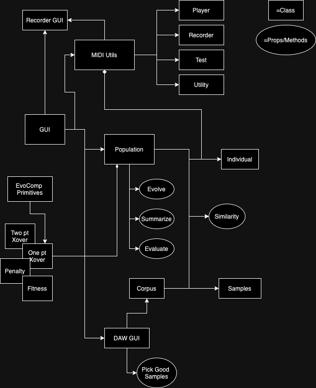

# Genetic Melodies

This project is a collaboration in designing genetic algorithms which are capable of creating melodies.

## Versioning

Dependencies are managed and frozen in `pom.xml` by maven.

- Java JDK = `openjdk 21.0.2`
- Maven = `3.9.6`

## Running

This project is built using maven, execution is done by targeting the javafx target with a run command:

> `mvn javafx:run`

## Architecture

A primary App gui is used as the main entrypoint into the application. This is built on javafx as a
frontend library. It then is used to create populations as well as transition to an evaluation phase
where a "DAW" window is opened up to allow for the identification of certain melodies as desirable. 
You can also trigger the MIDI recording GUI to open from here.

The EvoComp primitives allow for parameterized objects to be handed into the populations created by
the tool. These are then evaluated as part of the population methods.

A similarity metric is also used throughout the process. Whenever we calculate similarity, we offload
that work to a specific method, though where that lives in the class hierarchy is still open for
discussion and consideration.